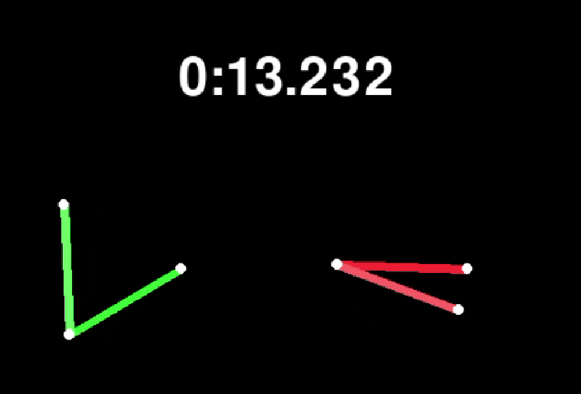

Chaos Visualization with Double Pendulums
=========================================

This directory comprises a Python program that simulates two double pendulums
swinging around with a slightly different initial angle to illustrate
sensitivity to initial conditions, i.e. chaos.

How to Run the Script
---------------------

- Install requirements: `pip install -r requirements.txt`
- Run the script: `python3 double_pendulum.py`.

Why Are Motions Different on Each Run?
--------------------------------------

If you run the script multiple times, you'll notice that the pendulums move
around in different ways on each execution, even though they keep the same
initial configurations. That's because the configuration of the pendulums is
computed from the time that elapses between two consecutive frames. Depending
on much other processes are using the CPU, that delay fluctuates, leading to
slightly different computations on each run. And since double pendulums are
highly sensitive to small modifications, these little differences end up
changing motions a lot over time.
