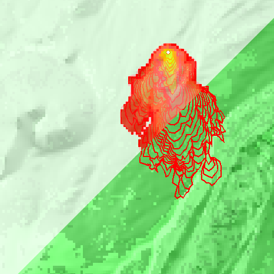

silex
=====

- `English (en) <#wildfire-prediction-software>`_
- `Français (fr) <#logiciels-de-prédiction-de-feux-de-forêt>`_

         canopy height and arrival time.

Wildfire Prediction Software
----------------------------

This repository presents wildfire modelling technologies.

Empirical Models
++++++++++++++++

**Empirical** wildfire modelling tools are based on **observations**.
Researchers analyze how wildfires behave and write programs that approximate
these fires to forecast their evolution.

Examples of empirical wildfire modelling tools:

- `BehavePlus <https://research.fs.usda.gov/firelab/products/dataandtools/behaveplus>`__
- `FlamMap <https://research.fs.usda.gov/firelab/products/dataandtools/flammap>`__
- `FARSITE (now part of FlamMap) <https://research.fs.usda.gov/firelab/products/dataandtools/farsite>`__

These tools rely on multiple types of data and combine several models to
simulate the complexity of wildfires appropriately. The file
`forecast.ipynb <forecast.ipynb>`__ presents databases and models used to
forecast wildfires and explains how to run FARSITE simulations on your own
system. You'll need `Anaconda <https://www.anaconda.com/download>`__ to run the
notebook.

Physics-Based Models
++++++++++++++++++++

**Physics-based** wildfire modelling tools are based on **fluid dynamics**.
Instead of using equations that approximate wildfires, they attempt to simulate
real physical phenomena, which tends to be way more computationally expensive
but can lead to more precise results.

Examples of physics-based wildfire modelling tools:

- `FDS <https://www.nist.gov/services-resources/software/fds-and-smokeview>`__
- `FIRETEC <https://www.canadawildfire.org/firetec>`__

Machine Learning Models
+++++++++++++++++++++++

Machine learning can be used to predict wildfires from past data. This approach
is newer than empirical and physics-based models, which have been around for
multiple decades. Machine learning became a viable alternative over the 2010s.

Examples of machine learning models for wildfire modelling:

- `Finney et al <https://research.fs.usda.gov/firelab/understory/deep-learning-high-resolution-wildfire-modeling>`__
- `Zhang et al <https://www.sciencedirect.com/science/article/pii/S1470160X21004003>`__

Chaos Visualization
+++++++++++++++++++

Wildfires and meteorological phenomena are highly sensitive to small effects,
like small differences in temperature, which can dramatically change how they
evolve. This sensitivity is called *chaos*. To visualize this effect on a
simple system, refer to the file `chaos/readme.rst <chaos/readme.rst>`__.

---------

Logiciels de prédiction de feux de forêt
----------------------------------------

Ce dépôt présente des technologies de modélisation des feux de forêt.

Modèles empiriques
++++++++++++++++++

Les modèles **empiriques** sont basés sur des observations. Les chercheurs
analysent le comportement des feux de forêt et en dérivent des équations qui
les approximent pour en prédire l'évolution.

Exemples de modèles empiriques :

- `BehavePlus <https://research.fs.usda.gov/firelab/products/dataandtools/behaveplus>`__
- `FlamMap <https://research.fs.usda.gov/firelab/products/dataandtools/flammap>`__
- `FARSITE (now part of FlamMap) <https://research.fs.usda.gov/firelab/products/dataandtools/farsite>`__

Ces outils s'appuient sur plusieurs types de données et combinent plusieurs
modèles pour simuler adéquatement la complexité des feux de forêt. Le fichier
`forecast.ipynb <forecast.ipynb>`__ présente des bases de données et des
modèles utilisés pour prédire les feux et explique comment exécuter une
simulation avec le logiciel FARSITE. `Anaconda <https://www.anaconda.com/download>`__
est requis pour exécuter le fichier.

Modèles physiques
+++++++++++++++++

Les modèles **physiques** sont basés sur la **dynamique des fluides**. Au lieu
d'utiliser des équation pour approximer les feux, ils simulent des phénomènes
physiques, ce qui demande généralement plus de ressources informatiques mais
entraînement des résultats plus précis.

Exemples de modèles physiques :

- `FDS <https://www.nist.gov/services-resources/software/fds-and-smokeview>`__
- `FIRETEC <https://www.canadawildfire.org/firetec>`__

Apprentissage automatique
+++++++++++++++++++++++++

Des modèles d'apprentissage automatique peuvent prédire des feux à partir de
données historiques. Cette approche est plus nouvelle que les modèles
empiriques et physiques, ces deniers étant utilisés depuis plusieurs décennies
tandis que les modèles d'apprentissage automatique ne sont devenus des options
viables qu'à partir des années 2010.

Exemples de modèles d'apprentissage automatique :

- `Finney et al <https://research.fs.usda.gov/firelab/understory/deep-learning-high-resolution-wildfire-modeling>`__
- `Zhang et al <https://www.sciencedirect.com/science/article/pii/S1470160X21004003>`__

Visualisation du chaos
++++++++++++++++++++++

Les feux de forêt et les phénomènes météorologiques sont très sensibles à des
effets relativement faibles. De petites différences de température peuvent
drastiquement changer le comportement d'un tel système, par exemple. Cette
sensibilité se nomme, en langage mathématique, *chaos*. Pour visualiser le
chaos sur un système simple, consultez le fichier `chaos/readme.rst <chaos/readme.rst>`__.
